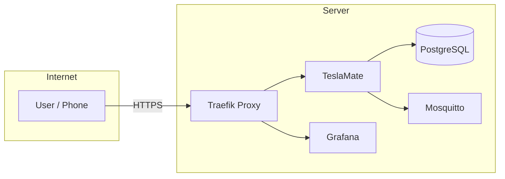

# TeslaMate on Oracle Cloud Free Tier

A deployment configuration for [TeslaMate](https://teslamate.org/) on Oracle Cloud Free Tier with HTTPS and public access from your phone or any device.

## What is TeslaMate?

[TeslaMate](https://teslamate.org/) is a self-hosted data logger for your Tesla vehicle. It logs driving data, charging sessions, and vehicle state, and provides beautiful Grafana dashboards for visualization. The official documentation is at [docs.teslamate.org](https://docs.teslamate.org/).

## What This Repo Provides

This is not a fork of TeslaMate—it uses the official `teslamate/teslamate` and `teslamate/grafana` Docker images and adds:

- **Traefik** reverse proxy with automatic Let's Encrypt HTTPS
- **Basic Auth** for TeslaMate and Grafana
- **Public access** from phone or any device (not just home network)
- Pre-configured `docker-compose.yml` with TeslaMate, PostgreSQL, Grafana, Mosquitto (MQTT), and Traefik
- Oracle Cloud Free Tier–oriented setup (ARM-compatible, minimal resources)

## Architecture



## Quick Start

**Prerequisites:** Oracle Cloud account, a domain name pointing to your server, Docker and Docker Compose.

1. Clone this repo and `cd` into it.
2. Copy `.env.example` to `.env` and fill in your values.
3. Copy `.htpasswd.example` to `.htpasswd` and change the default password before going live.
4. Run `docker compose up -d`.

For a full step-by-step guide including VM creation, domain setup, and troubleshooting, see **[ORACLE_CLOUD_DEPLOYMENT.md](ORACLE_CLOUD_DEPLOYMENT.md)**.

## Configuration

Required variables in `.env`:

| Variable | Description |
|----------|-------------|
| `TM_ENCRYPTION_KEY` | Run `openssl rand -base64 32` and paste the result |
| `TM_DB_PASS` | Strong PostgreSQL password |
| `GRAFANA_PW` | Grafana admin password |
| `FQDN_TM` | Your domain (e.g. `teslamate.yourdomain.com`) |
| `LETSENCRYPT_EMAIL` | Your email for Let's Encrypt |

Generate a `.htpasswd` with your own password:

```bash
htpasswd -nbB teslamate YOUR_PASSWORD > .htpasswd
```

## Security Checklist

- [ ] Replace `TM_ENCRYPTION_KEY` with a strong random key
- [ ] Use strong `TM_DB_PASS` and `GRAFANA_PW`
- [ ] Change `.htpasswd` password from default `changeme`
- [ ] Keep `.env` and `.htpasswd` out of version control (they are in `.gitignore`)

## Links

- [Full deployment guide](ORACLE_CLOUD_DEPLOYMENT.md)
- [TeslaMate documentation](https://docs.teslamate.org/)
- [TeslaMate GitHub](https://github.com/teslamate-org/teslamate)
